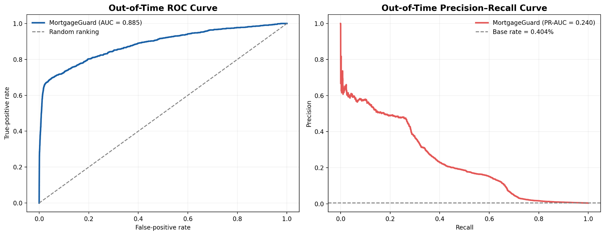
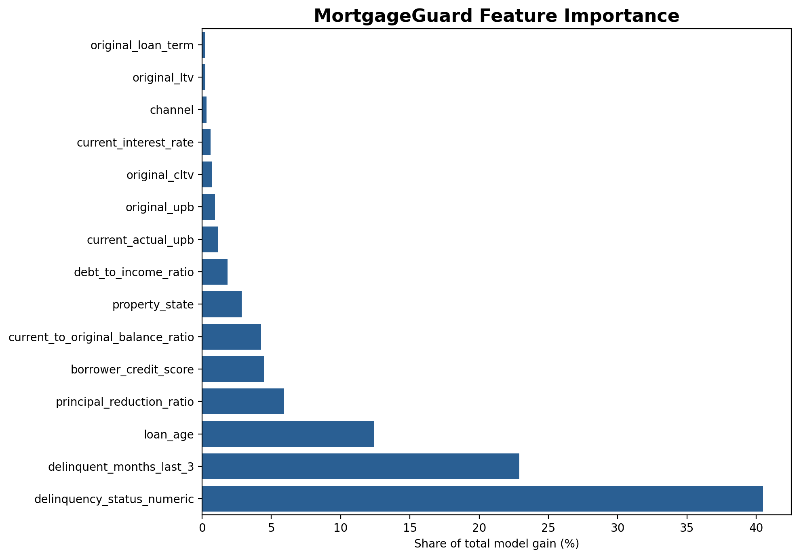

# MortgageGuard

### Early warning for mortgage delinquency risk

MortgageGuard predicts whether an active mortgage will become seriously delinquent—three or more months past due—within the next six months. The project turns a 3.27 GB Fannie Mae performance file into a leakage-aware modeling dataset and an operational outreach strategy.

> **Headline result:** On the untouched test period, the highest-risk 1% of currently performing loan-months contained **18.22% of future serious delinquencies**, producing **18.22× lift over random selection**.



## Why this project matters

Mortgage servicers have limited outreach capacity. A useful model should not simply rank loans already showing obvious distress; it should help identify currently performing borrowers who may benefit from early, supportive contact.

MortgageGuard was designed around that decision. Its primary operational evaluation asks: **among loans currently reported as current, how many future serious delinquencies can be found within a fixed outreach budget?**

## Results

| Test-period result | Value |
|---|---:|
| ROC-AUC | 0.8846 |
| PR-AUC | 0.2399 |
| Currently performing observations | 827,402 |
| Future serious delinquencies | 1,416 |
| Base event rate | 0.171% |
| Top-1% outreach alerts | 8,274 |
| Serious delinquencies captured | 258 |
| Precision at top 1% | 3.12% |
| Recall at top 1% | 18.22% |
| Lift over random outreach | 18.22× |

The validation comparison was deliberately strict: at the same 5,900-alert capacity, LightGBM found 972 positive cases versus 969 for a rule based on current delinquency status. That small improvement shows that the model's more meaningful value is **earlier prioritization among borrowers who are still current**, not replacing an obvious delinquency rule.

## Dataset and modeling design

- **Source:** Fannie Mae Single-Family Loan Performance Data, 2019 Q1 acquisition cohort
- **Raw scale:** 11,774,637 monthly records across 341,865 mortgages
- **Modeling population:** 7,145,733 active loan-months across 265,370 mortgages
- **Target:** serious delinquency within the next six consecutive observed months
- **Eligibility:** observations before the loan's first serious delinquency with a positive current balance
- **Model:** LightGBM gradient-boosted trees
- **Primary metric:** precision-recall AUC, selected because the target is rare

### Time-based validation

The data is split chronologically, with six-month embargo periods between samples to match the prediction horizon and reduce label overlap:

| Sample | Observation period | Loan-months | Positive rate |
|---|---|---:|---:|
| Training | Jul 2019–Dec 2022 | 5,171,659 | 2.346% |
| Embargo | Jan 2023–Jun 2023 | 756,005* | — |
| Validation | Jul 2023–Dec 2023 | 378,072 | 0.423% |
| Embargo | Jan 2024–Jun 2024 | included above* | — |
| Test | Jul 2024–Sep 2025 | 839,997 | 0.404% |

\*The combined embargo periods contain 756,005 records.

## Most influential features

Recent payment behavior dominated the model, followed by loan age, principal reduction, borrower credit score, and remaining balance ratio.



## Technical workflow

1. Stream and select fields from the multi-gigabyte pipe-delimited source using DuckDB.
2. Validate loan-month uniqueness, dates, balances, and delinquency codes.
3. Build a forward-looking six-month target using consecutive monthly records.
4. Create lagged behavior and balance-reduction features using only information available at prediction time.
5. Apply chronological training, embargo, validation, and test windows.
6. Compare LightGBM with a transparent delinquency-status rule.
7. Evaluate ranking quality at realistic outreach capacities.

## Repository structure

```text
MortgageGuard/
├── README.md
├── requirements.txt
├── .gitignore
├── assets/
│   ├── mortgageguard_model_performance.png
│   └── mortgageguard_feature_importance.png
└── notebooks/
    ├── 01_data_preparation.ipynb
    └── 02_eda_and_modeling.ipynb
```

## Reproducing the analysis

1. Download the 2019 Q1 acquisition cohort from the [Fannie Mae Single-Family Loan Performance Data](https://capitalmarkets.fanniemae.com/credit-risk-transfer/single-family-credit-risk-transfer/fannie-mae-single-family-loan-performance-data) portal. Access may require accepting Fannie Mae's terms.
2. Create a private data directory outside version control and place the downloaded archive there.
3. Install the dependencies:

   ```bash
   pip install -r requirements.txt
   ```

4. Run `notebooks/01_data_preparation.ipynb`, then `notebooks/02_eda_and_modeling.ipynb`.

The raw data, processed loan-level files, and trained model are intentionally excluded from this public repository.

## Responsible use and limitations

- The model uses one acquisition cohort and should be tested on additional vintages before deployment.
- Economic conditions and servicing policies change over time, so performance should be monitored for drift.
- Feature importance describes model usage, not causal effects.
- State-level and borrower-related performance should be reviewed for fairness before any real-world application.
- Predictions should support early servicing assistance—not adverse credit, pricing, or eligibility decisions.

## Author

**Elvira Ongoue**  
B.S. Data Science, University of Maryland Global Campus — expected May 2027

